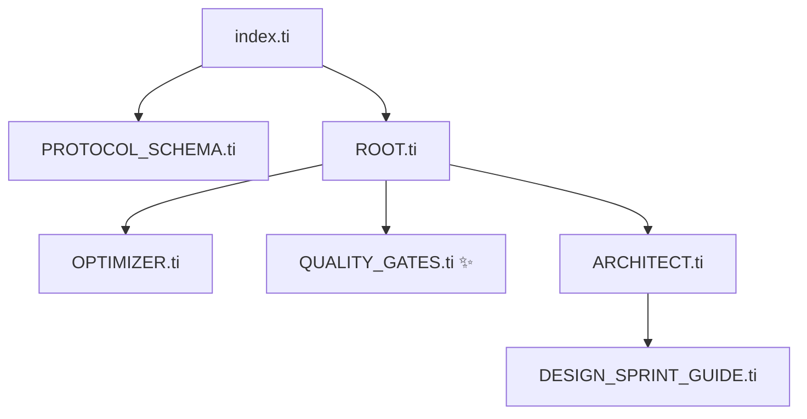

# Quality Gates Walkthrough (2026-02-26)

Origin: Kvit test assignment post-mortem — 8 reviewer issues abstracted into universal rules.

## Load Graph

## Files Changed

| File                                    | Change                                                              |
| --------------------------------------- | ------------------------------------------------------------------- |
| `core/QUALITY_GATES.ti`                 | **NEW** — typing, tooling, consistency, performance, delivery gates |
| `guardians/ROOT.ti`                     | Added `QUALITY_GATES.ti` to includes                                |
| `guardians/ARCHITECT.ti`                | `state-management` + `style-discipline` sections                    |
| `guardians/QA.ti`                       | `delivery-gates`, dead code, E2E, console gates                     |
| `guardians/DEVOPS.ti`                   | Single lock file, tooling baseline                                  |
| `core/OPTIMIZER.ti`                     | "Delivery is a user flow" lesson                                    |
| `instances/kvit/sprints/POST_MORTEM.md` | Instance record with all 8 issues                                   |

## Feedback → Rules

| #   | Issue                       | Rule                 | Guardian      |
| --- | --------------------------- | -------------------- | ------------- |
| 1   | Mixed lock files            | Single Lock File     | DEVOPS        |
| 2   | Inconsistent state access   | Access Consistency   | ARCHITECT     |
| 3   | MapContainer full re-render | Observable Isolation | ARCHITECT     |
| 4   | `authStore: any`            | Zero `any`           | QUALITY_GATES |
| 5   | Unused variable             | Dead Code gate       | QA            |
| 6   | No linter/prettier          | Tooling Baseline     | DEVOPS        |
| 7   | Mixed MUI + CSS             | Style Discipline     | ARCHITECT     |
| 8   | WebSocket error on register | E2E Smoke gate       | QA            |
