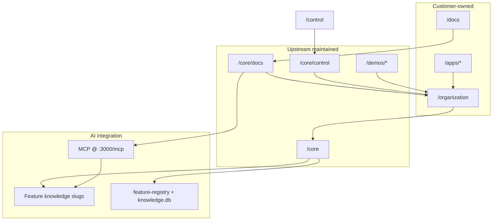

# Architecture Map

**Scanned:** 2026-06-18

## System overview



## Three-layer cascade

Per knowledge slug `layer-cascade` and ADR-002:

| Layer | Priority | Contents |
|-------|----------|----------|
| App (highest) | Wins conflicts | pages, app-specific server routes |
| Organization | Branding | `app.config.ts`, public assets |
| Core (lowest) | Defaults | shared components, middleware, plugins |

**Merge rules:** `defu` deep-merge for configs; arrays **concatenate**; same-named components — higher layer wins entirely.

**Critical:** `server/middleware/` from **all layers runs** — cannot override, only add.

## Server plugin order (core)

| Plugin | Feature slug | Role |
|--------|--------------|------|
| `00.startup.ts` | startup | Boot diagnostics |
| `01.settings-loader.ts` | runtime-config | Load config from provider |
| `02.logging.ts` | structured-logging | Request logging |
| `03.feature-registry.ts` | feature-knowledge | Dev registry sync |
| `04.integrations.ts` | integrations | AI model profiles |

## Server middleware order (core)

| Middleware | Feature slug |
|------------|--------------|
| `00.requestId.ts` | request-tracking |
| `01.rateLimit.ts` | rate-limiting |
| `02.logging.ts` | structured-logging |
| `03.auth.ts` | authentication |

## Feature knowledge system

**Join key:** kebab-case slug (e.g. `runtime-config`).

| Dimension | Location |
|-----------|----------|
| Knowledge (source of truth) | `core/docs/knowledge/{slug}.md` |
| Static traceability | `// SEE: feature "slug" at path` |
| Runtime instrumentation | `defineFeatureHandler`, `defineFeaturePlugin`, `defineFeatureComposable` |
| Operational cache | `knowledge.db`, `logs.db` (.gitignored, rebuildable) |

**Agent rule:** Pull via MCP `explain(slug)` — do not preload ADRs.

## Documentation architecture

| Collection | Source | Purpose |
|------------|--------|---------|
| `docs` | `core/docs/content/` | App Agent reference (read-only for customers) |
| `customerInternal` | `docs/content/internal/` | Merges into `/internal/` |
| `customerDocs` | `docs/content/` top-level | Customer sections |

MCP server lives in **docs-layer** (`core/docs/server/mcp/`). Customer docs app at `/docs` extends the layer and exposes MCP at port 3000.

## Control plane

`core/control` provides:

- Feature graph UI (`/features`, `/features/[slug]`)
- Logs stream and summary (`/logs`, API under `/api/control/logs`)
- i18n management (`/i18n`)
- Agent chat (`/agent`, `POST /api/control/agent/chat`)
- Settings diff viewer

Extends organization → core. Entry app at `/control` on port 3001.

## Runtime configuration

ADR-005 implemented:

- `ConfigProvider` abstraction (Supabase, SQLite)
- Settings API: `GET/PUT/DELETE /api/settings/*`
- `deepMerge` with `$meta.lock` governance
- Supabase Realtime for cache invalidation

## Chat applications (two distinct apps)

| App | Path | Purpose |
|-----|------|---------|
| Customer chat | `apps/chat` | Port 3002; extends org; `defineFeatureHandler('chat-status')` |
| Demo chat | `demos/chat` | Port 3013; Nuxt UI chat template reference |

Both need env setup (AI Gateway, OAuth, DB) — see `apps/chat/README.md`.

## ADR → knowledge migration

ADRs 001–009 in `core/docs/adr/` are **archived**. Operational truth lives in:

- `core/docs/knowledge/*.md` (15 slugs)
- MCP tools (`explain`, `record`, `census`, …)
- [GitHub Issues](https://github.com/app-agent-io/core/issues)

## Data flow: agent asks about a feature

```
Agent → MCP explain("rate-limiting")
      → knowledge.ts reads core/docs/knowledge/rate-limiting.md
      → returns aspect or full file

Agent → edits handler with // SEE: feature "rate-limiting"
      → feature:health / census validates coverage
```

## Technology stack

- **Nuxt 4.3** + Vue 3.5 + TypeScript 5.9
- **Bun 1.2** package manager
- **Turborepo 2.4** monorepo
- **Nuxt UI v4** (docs/demos) / v3 (core layer)
- **Supabase** — config provider, auth backing
- **Vitest 4** — unit tests
- **@nuxtjs/mcp-toolkit** — MCP on docs app
