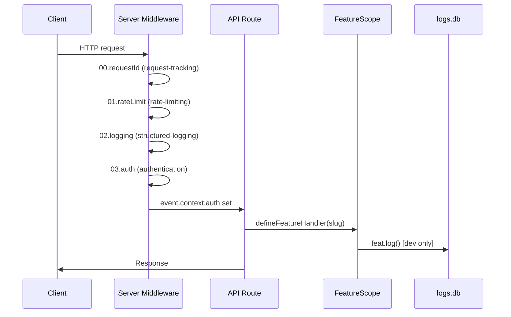
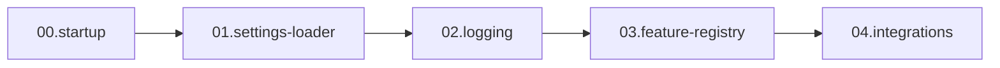
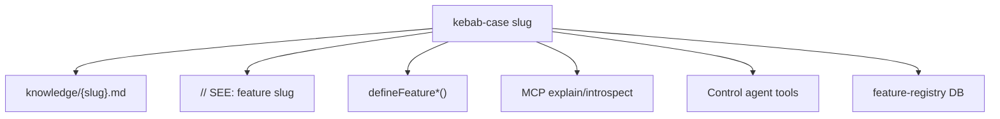
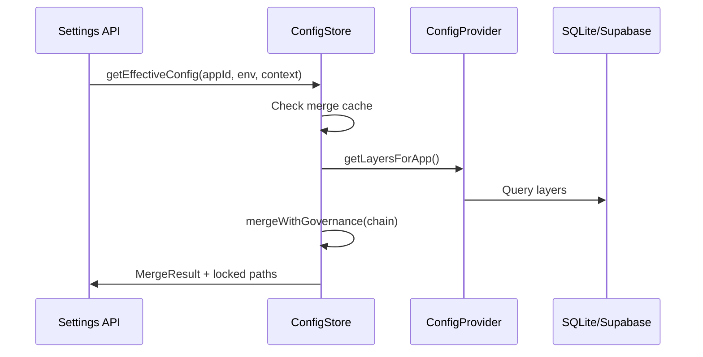

# Deep Dive: Cross-Cutting Flows

**Traced:** 2026-06-18 (S03)

## HTTP request lifecycle



## Nitro plugin boot order



| Plugin | Slug | Failure mode |
|--------|------|--------------|
| settings-loader | runtime-config | Disables config service, static config only |
| feature-registry | feature-knowledge | Dev only — SEE scan may warn |
| integrations | integrations | Silent skip or warn on partial AI config |

## Feature slug join (ADR-009)



## Agent onboarding path (Denis workspace)

```text
1. read totem/totem-v6/index.ti
2. load instance app-agent
3. read intel/TOTEM_INDEX.ti
4. read intel/DEEP-FLOWS.md (this file) for orientation
5. bun --bun nuxt dev in docs/ → MCP connect
6. explain("layer-cascade") before architectural changes
7. Check PROBLEMS_REGISTER P0 before claiming green
```

## Config read path (runtime)



## Dev vs prod behavior summary

| System | Dev | Prod |
|--------|-----|------|
| Feature registry | Active, SQLite persistence | Disabled |
| feat.log → logs.db | Yes | No |
| SEE scanner | On startup | No |
| MCP server | If docs app running | Deploy docs app |
| Config hot-reload | Realtime subscribe | Realtime subscribe |
