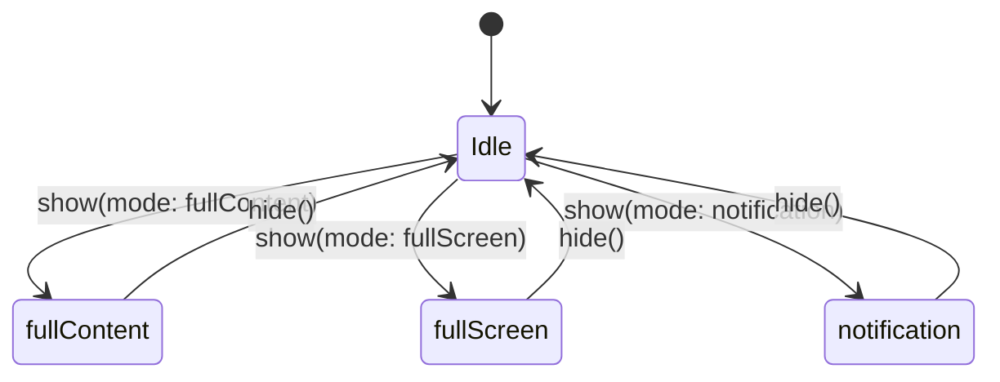

# S56-Loading-Lifecycle — Loader Modes and Usage

**Task:** S56-TB4-Loading-Lifecycle-Diagram  
**Purpose:** Single GlobalLoader concept; behavior by state, not multiple components.

---

## Modes

| Mode | Description | Blocks |
|------|-------------|--------|
| **fullContent** | Area from header to footer; footer (e.g. nav) remains interactive | Content area only |
| **fullScreen** | Whole screen overlay; no interaction until dismiss | Entire viewport |
| **notification** | Non-blocking overlay (e.g. top/bottom toast or small spinner) | Does not block nav or main content |

---

## Map to flows

| Flow | Recommended mode | Rationale |
|------|------------------|------------|
| Footer / main nav transition | fullContent (or none) | Don’t block nav; optional content-area loader for initial load |
| Tracking Player (loading track, loading point) | notification | User can still use map/controls; short-lived |
| Report generation | fullScreen | Long-running; user waits for result |
| Tracking Action (load track on map) | fullContent or notification | Prefer notification so map stays responsive |
| Initial app load / auth | fullScreen | Full blocking until ready |
| Object list / vehicle fetch | fullContent or notification | Per design system |

---

## Single GlobalLoader concept

- **One** loader abstraction (e.g. GlobalLoader) with **state:** `{ active: boolean, mode: 'fullContent' | 'fullScreen' | 'notification', message?: string }`.
- UI renders loader overlay based on state; no separate “track loader”, “report loader”, “map loader” components. Behavior by state only.
- Diagram (lifecycle):

- Feeds Loader system spec and state proposal (loadingState in central state). No implementation — planning only.
