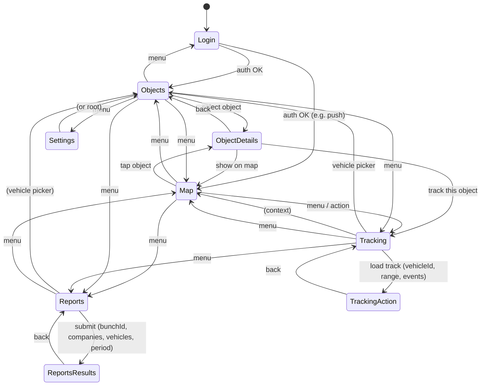

# S56-Navigation-Flow — Navigation Flow (State-Driven)

**Task:** S56-TB2-Navigation-Flow-Diagram  
**Purpose:** Header and state architecture design; state-driven, not page-driven.

---

## Header modes and entry points

| Mode | Description | Entry / transition |
|------|-------------|--------------------|
| **Objects** | List of vehicles/objects | Menu → Objects |
| **Object Details** | Single object/vehicle detail | Objects → select object |
| **Map** | Map view (all or context) | Menu → Map; Push notification → Map |
| **Tracking** | Tracking query (vehicle, period, events) | Menu → Tracker |
| **Tracking Action** | Map + playback / point detail | Tracking → load track → Tracker Map |
| **Reports** | Report type and param selection | Menu → Reports |
| **Reports Results** | Report output view | Reports → submit → Results |
| **Settings** | App settings | Menu → Settings |
| **Login** | Auth | Menu → Login; app start |

---

## Mermaid: navigation flow (state-driven)

---

## Header mode ↔ view state

- **headerMode:** One of Objects | ObjectDetails | Map | Tracking | TrackingAction | Reports | ReportsResults | Settings | Login.
- **headerViewState:** Collapsed vs expanded (e.g. system bar); context title/subtitle per mode (e.g. vehicle name in Tracking, report name in Reports).
- Transitions above define when headerMode and headerViewState update; UI depends on these states, not on route string alone.

---

## Alignment

- Aligns with S56-Reverse-Documentation-Report (navigation source of truth) and reverse iOS/Android flows.
- Header spec: collapsed/expanded, context per mode. No implementation — planning only.
