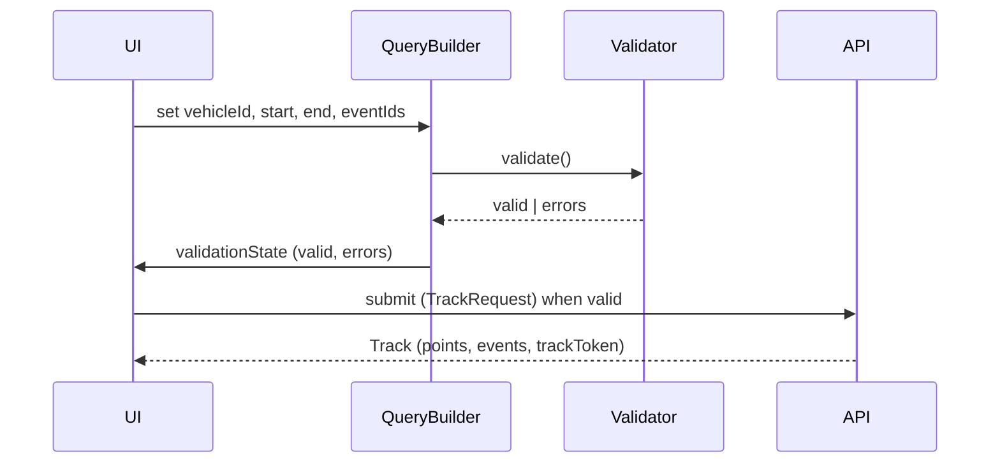
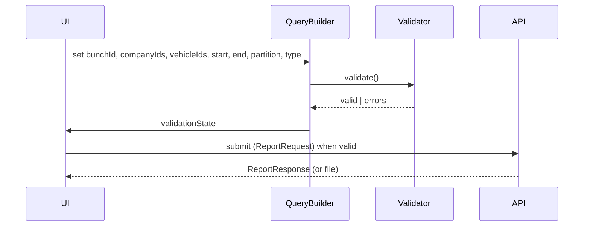

# S56-Query-Lifecycle — Query Lifecycle (Tracking & Reports)

**Task:** S56-TB3-Query-Lifecycle-Diagram  
**Purpose:** Single QueryValidator / query-builder concept; build → validate → submit.

---

## Tracking query

**Parameters:** vehicleId, date range (start, end in ms), report type (implicit: track), vehicle (one), event types + count (eventIds[]).

**Validation state:** vehicleId required; start & end required and start < end; eventIds optional (default all or configured). Invalid: disable submit or show inline errors.

**Flow:**

- **Build:** Collect vehicleId, start, end, eventIds from UI (date pickers, vehicle selector, event type checklist).
- **Validate:** One place: required fields, start < end, non-empty vehicle. Same rules for Web/Desktop.
- **Submit:** POST /ws/track/get with TrackRequest. No duplication of request-building logic.

---

## Reports query

**Parameters:** date range (start, end), period type (partition: e.g. PERIOD, DAILY), companies (companyIds[]), vehicles (vehicleIds[]), report type (bunchId), format (type: json, json2, xml).

**Validation state:** bunchId required; at least one company or vehicle as per business rule; start & end required; partition and type valid. Invalid: disable submit or show errors.

**Flow:**

- **Build:** Load reports list (GET /ws/reports), companies (GET /ws/getcompanies), vehicles (GET /ws/vehicles). User selects; build ReportRequest.
- **Validate:** Single validator: required bunchId, date range, at least one scope (company/vehicle) if required by report type.
- **Submit:** POST /ws/doreport. One query-builder concept for reports; no duplicate logic per platform.

---

## Single QueryValidator / query-builder concept

- **Tracking** and **Reports** share: build → validate → submit. Validation state (valid, errors) drives UI (submit disabled, inline messages).
- One module or namespace per domain (tracking vs reports) is acceptable; validation and request formation must not be duplicated across Header/Player/Reports screens.
- Aligns with reverse docs and API (TrackRequest, ReportRequest). Planning only — no code.
