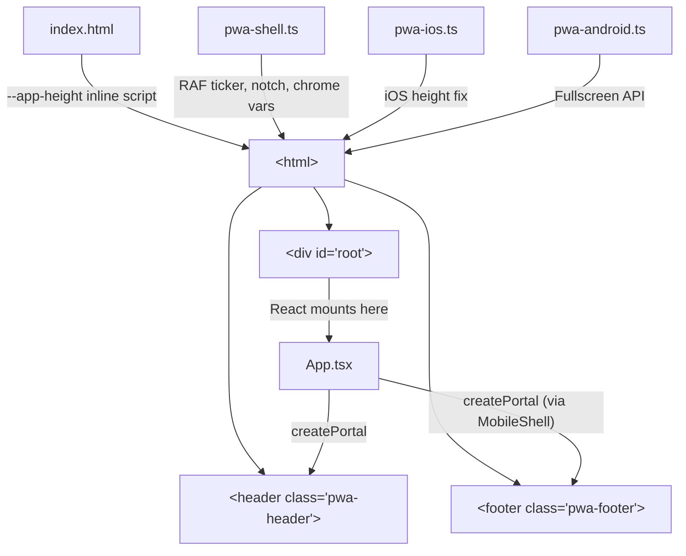

# PWA template – work summary

Context: **navitrack-apps/draft/PWA-template** vs **totem/stacks/pwa** (PWA.ti gold standard).

---

## Current implementation (PWA-template)

Summary of what the draft template implements as of the latest updates.

### Shell and layout

- **Header / footer:** `.pwa-header` and `.pwa-footer` are fixed outside `#root`; inner divs use `env(safe-area-inset-top/bottom/left/right)` for padding. In landscape, horizontal padding uses `max(12px, env(safe-area-inset-left/right))` so safe area is never dropped.
- **Single scroll:** Only `.main-scroll` inside `#root` scrolls. Top/bottom padding = `12px + env(safe-area-inset-top/bottom) + var(--pwa-header-height|--pwa-footer-height)` (fallback 48px). When header/footer are empty, `body.header-empty` / `body.footer-empty` reduce to `8px + env(safe-area-*)`.
- **Header/footer height:** JS observes `.pwa-header` and `.pwa-footer` (MutationObserver, ResizeObserver, resize). It sets `--pwa-header-height` and `--pwa-footer-height` on `html` from `offsetHeight`, so main-scroll padding is tied to actual chrome height.

### Horizontal safe area (notch / curved edges)

- **data-notch-side:** JS sets `data-notch-side` on `html`: `"left"` | `"right"` | `"both"` | `"none"`. When **both** left and right insets are > 0, `"both"` is used so `.main-scroll` gets both paddings. On Android in fullscreen, angle is used when only one inset; when both > 0 use `"both"`. Otherwise only the notch side gets padding.
- **Android:** Horizontal safe area only when in fullscreen (`inFullscreen()`); otherwise `data-notch-side="none"`. Orientation/insets are observed every frame (same ticker as iOS) so notch side updates on 270°↔90° rotation. Optional extra top safety padding (4px) in android.css.
- **iOS:** Orientation/insets observed every frame in the RAF ticker. In browser tab (non-standalone), angle/insets can lag on orientationchange; template schedules delayed `updateNotchSide` at 2, 8, 16 frames so the notch side updates after 180° rotate.

### Ticker and timing

- **Single RAF loop:** One `requestAnimationFrame` ticker (`window.PWA_TICKER`). No `setTimeout` / `setInterval`. Flags drive work: `appHeight`, `notchSide`, `chromeEmpty`, `pwaNoScroll`. `schedule(fn, frames)` for delayed runs; `everyNFrames(n, fn)` returns an unsubscribe. iOS delayed height steps and height-debug refresh use the ticker.
- **Memory:** One reusable probe element for `getSafeAreaInsetPx()`. `everyNFrames` unsubscribe avoids callback list growth. Event listeners and observers are not removed (page lifetime).

### Platform

- **Classes on html:** `platform-ios` and `platform-android` from UA. Used to hide fullscreen + Light theme on iOS; no Android-only main-scroll overrides (base.css applies for all).
- **iOS:** ios-pwa.js runs in standalone; one-time height fix + orientation handling; no in-page fullscreen button.
- **Android:** android-pwa.js shows fullscreen / exit fullscreen buttons; horizontal safe area only in fullscreen.

### Theme, manifest, debug

- **Theme:** Light/dark/system with CSS variables; theme-color meta updated; theme switcher in header.
- **Manifest:** Cache-busted in dev; service worker registered.
- **Height debug:** Loaded when URL has `?debug`; uses `PWA_TICKER.everyNFrames(30, refresh)` when available.

### Desktop and config

- **Config (config.js):** `PWA_WRAPPER_CONFIG` for title, colorLight, colorDark. `disableContextMenu: true` hides the browser right-click context menu (app-like feel).
- **Desktop limits:** OS app menu and browser chrome (address bar, extension icons, ⋮ menu) cannot be hidden from the page; only manifest `display` (e.g. fullscreen/standalone) affects the installed window. Right-click context menu is the only UI that can be disabled via the template.

### Files (draft template)

- **js:** common.js (ticker, app height, theme, notch side, chrome height, screen buttons), ios-pwa.js, android-pwa.js, height-debug.js, config.js
- **css:** base.css (main-scroll padding with vars + safe area, data-notch-side), theme.css (header/footer, landscape safe area, theme switcher), android.css (fullscreen UI, optional extra top padding for Android)
- **html:** Shell (header, footer, #edge) outside #root; app content and .main-scroll inside #root

---

## What is good

- **Viewport:** `viewport-fit=cover`, `--app-height` from visualViewport, `interactive-widget=resizes-content`.
- **Display / manifest:** Fullscreen/standalone, theme_color; iOS apple-mobile-web-app meta; Android Fullscreen API + UI.
- **Layout:** Single scroll container; header/footer fixed with safe-area padding; main-scroll padding uses observed header/footer height and safe areas; horizontal safe area via data-notch-side (including "both" when both insets > 0); landscape keeps horizontal safe area for header/footer.
- **Timing:** Single RAF ticker; no setTimeout/setInterval; flags and schedule/everyNFrames.
- **Theme:** Light/dark/system; theme-color meta in sync.
- **Structure:** Shell vs app split; common / ios-pwa / android-pwa; platform classes; cache-busted assets in dev.

---

## What is wrong or missing (vs PWA.ti / ideal)

- **PWA.ti alignment:** Viewport does not use `user-scalable=no` (accessibility trade-off). html/body use overflow+height when pwa-no-scroll, not `position: fixed`. Debug panel position could use safe-area insets for bottom/left.
- **Corners:** If the template adds corner UI, it should be `position: fixed` outside the scroll container with safe-area insets (per PWA.ti).
- **iOS height script:** Height is applied to html, body, #root, and --app-height in ios-pwa.js; if #root is ever made the only fixed scroll container, height should not be set on that container per PWA.ti.
- **Landscape header/footer:** theme.css still uses fixed `12px` in the landscape media query for header/footer horizontal padding; PWA.ti prefers `max(12px, env(safe-area-inset-*))` so safe area is never dropped.

---

## One-line summary

**Implemented:** Viewport, manifest, single scroll under fixed header/footer, observed chrome height + safe areas, horizontal notch (left/right/both) with per-frame observation on Android and iOS, iOS browser-tab delayed notch update on orientationchange, Android optional extra top padding, single RAF ticker, no timers, platform classes, theme, optional context-menu disable (desktop).  
**Optional/alignment:** user-scalable=no, position:fixed reset, corner positioning, height-debug safe-area position, landscape header/footer max(12px, env(safe-area-inset-\*)).

---

## NaviTrack integration (2026-02-26)

The PWA template was applied to the NaviTrack React 19 + Vite + Tailwind app (`navitrack-apps/src-client`).

### Architecture

**Key pattern:** Header/footer chrome lives **outside** `#root` as raw DOM elements (`<header class="pwa-header">`, `<footer class="pwa-footer">`). React uses `createPortal` to project UI content into them. This gives gold-standard PWA layout (fixed chrome, single scroll, safe areas) while keeping all React state management intact.

### Files added (`src-client/src/pwa/`)

| File             | Role                                                                                                         |
| ---------------- | ------------------------------------------------------------------------------------------------------------ |
| `pwa-shell.ts`   | RAF ticker, `--app-height`, platform classes, `data-notch-side`, `--pwa-header-height`/`--pwa-footer-height` |
| `pwa-ios.ts`     | iOS standalone height fix (overshoot → settle)                                                               |
| `pwa-android.ts` | Android Fullscreen API; exports `goFullscreen()` / `exitFullscreen()`                                        |
| `pwa-shell.css`  | `pwa-no-scroll`, fixed header/footer, `pwa-main-scroll`, notch-side rules, safe areas                        |

### Files modified

| File               | Change                                                                                 |
| ------------------ | -------------------------------------------------------------------------------------- |
| `index.html`       | `interactive-widget`, `--app-height` inline script, `pwa-header`/`pwa-footer` elements |
| `main.tsx`         | Import PWA shell (side-effect) before React                                            |
| `App.tsx`          | DevHeader portaled into `.pwa-header` via `createPortal`                               |
| `mobile-shell.tsx` | Bottom nav portaled into `.pwa-footer` with `pwa-footer-inner` wrapper                 |
| `dev-header.tsx`   | Wrapped in `pwa-header-inner`; removed manual `fixed` positioning                      |
| `index.css`        | `#root` flex column, `--app-height` in `min-height`                                    |
